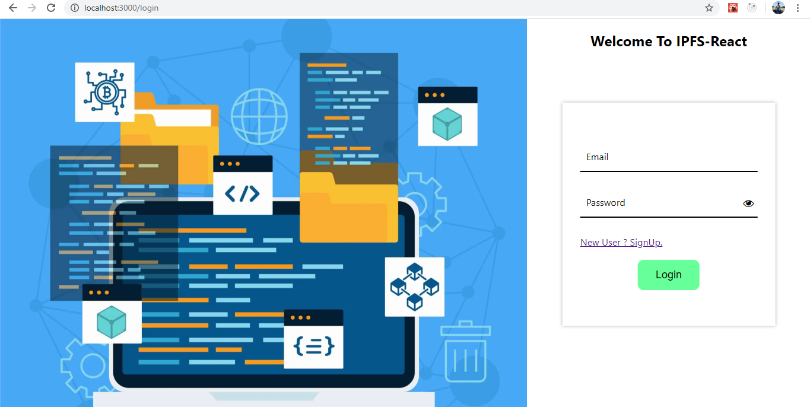
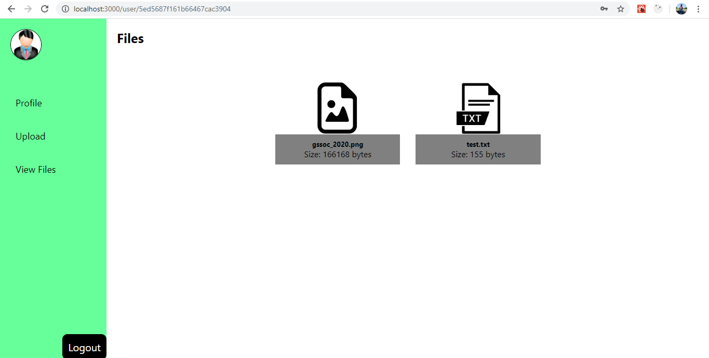
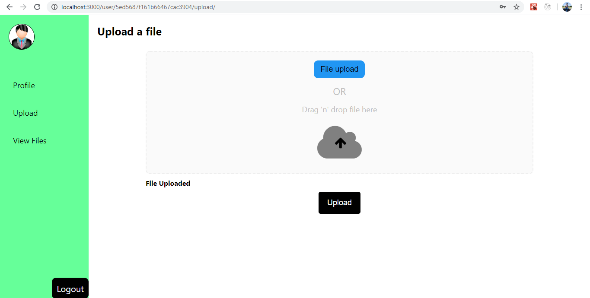

## Project Description
The project IPFS-React is a file upload system in which user have to login and that's it, you are ready to upload files.
Project features the concept of interplanetary system which divides the file into blocks using Merkle-DAG (tree like structure) structure where each node is the called the block, storing hash at each node, combines to form an actual file.  
IPFS searches the file on the basis of content, therefore when same file is uploaded multiple times same hash is returned, thus reducing the redundancy of storage.  
  
Using the concept of IPFS this project aims to upload file on IPFS and retrieve back the hash of files.  
And so, viewing the files on IPFS localhost for now.

The technology used to build this project are: -
1. Frontend
    - ReactJS
2. Backend
    - NodeJS
    - ipfs-http-client
3. Database
    - MongoDB
    
### Preview of the Project
1. Login Screen - If the user is an existing user then login directly else you have to sign up first.  
  
2. User Files screen.  

3. User Upload Screen

## How to setup the project
1. git clone the repository [git-repo](https://github.com/ashishnagpal2498/cloud-titans-IPFS.git)
2. ``npm install`` 
3. This will install all the frontend packages you need.
4. `npm start` - This will start the react application
5. Open a separate terminal - *cd backend* - and again ``npm install`` 
6. Run the backend server using command - ``npm start``
7. Setup MongoDB locally - install mongodb.
8. Create a folder inside the project
9. Add a terminal and start mongoDB server by and providing the path to that folder to mongoDB using command `mongod --dbpath={path}` ('braces not include").
10. Now, we need to start the IPFS daemon. Download and setup IPFS. [Download and setup](https://docs.ipfs.io/how-to/command-line-quick-start/#install-ipfs)
11. Add a new terminal and start ipfs daemon.

## Available Scripts

In the project directory, you can run:

### `npm start`

Runs the app in the development mode. 
Open [http://localhost:3000](http://localhost:3000) to view it in the browser.

The page will reload if you make edits. 
You will also see any lint errors in the console.
